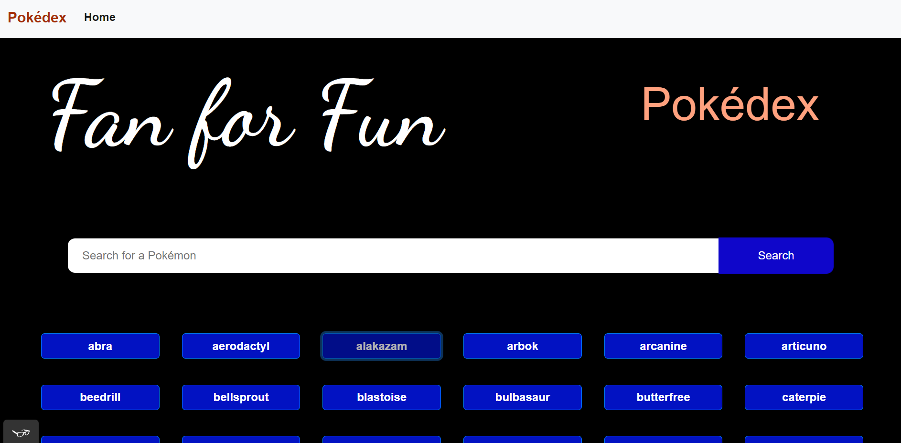

# A Sample Pokédex Application

**Developer:** ***Emmanuel Nodol***

**This** application is a school achievement project I built along with a jQuery To-Do app to conclude my second achievement during my Full-Stack Web Development Course at [CareerFoundry](https://careerfoundry.com/en/referral_registrations/new?referral=Z7BGvXrP).

### Role For Project

I was responsible for building this app from start to finish drawing inspiration from what I learnt from the course exercises thus far. An app that calls the free [Pokémon API](https://pokeapi.co/docs/v2) to display list of pokémons and then uses BootStrap library to designing the UI of pokémon list and Navbar for the page.

#### Challenges Of this Project

The main challenge faced was how to automate minifying code for production since the project is based on ``HTML``,`` CSS`` and ``Vanilla JavaScript``, but I was able to obtain a fast solution from the exercise lessons which pointed me in the right direction with links such as [JavaScript Minifier](https://www.toptal.com/developers/javascript-minifier). To minify CSS you may want to use this quick link [CSS Minifier](https://www.toptal.com/developers/cssminifier)

Also, I used to have challenges setting up polyfill when required, during this achievement I gain a good understanding of how it was done and implemented it.

### Project Informations

- - [repository](https://github.com/NodEm9/pokemonapp) 

- - [nodem9.github.io/pokemonapp/](https://nodem9.github.io/pokemonapp/)

### Tech Stacks

- [HTML](https://www.w3schools.com/html/)
- [CSS](https://www.w3schools.com/css/default.asp)
- [JavaScript](https://developer.mozilla.org/en-US/docs/Web/JavaScript)
- [esLinst](https://eslint.org/)
- [Bootstrap](https://getbootstrap.com/docs/5.3/getting-started/introduction/)